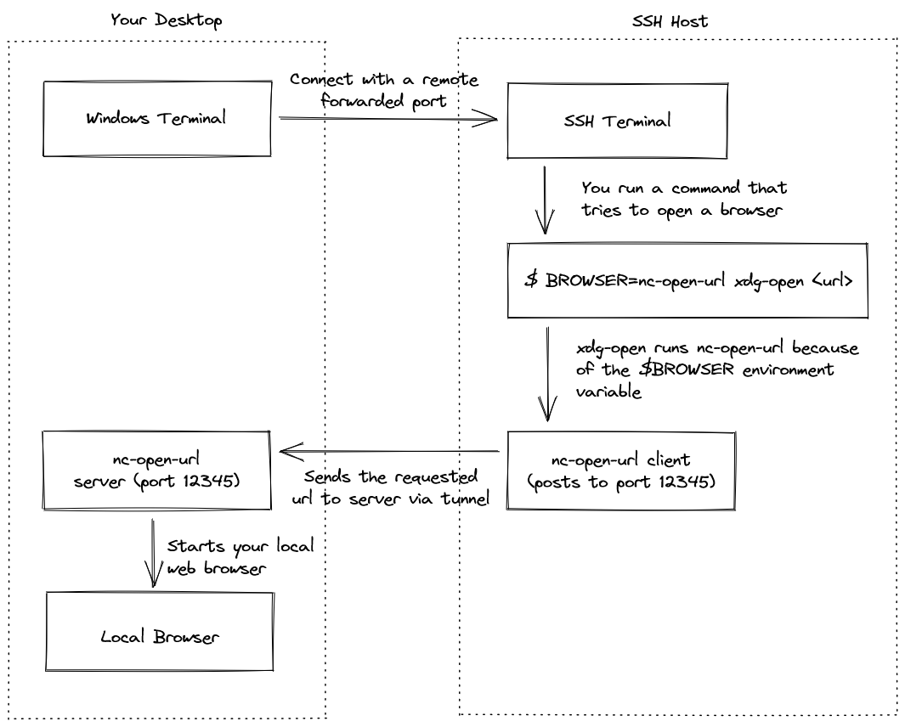

# URL Opener for SSH Tunnels

nc-open-url is a command-line tool that helps open your local browser when
your terminal doesn't support xdg-open.

## `nc-open-url` downloads

- [x86_64-pc-windows-gnu](https://misterjoshua.github.io/nc-url-opener/nc-url-opener-x86_64-pc-windows-gnu.zip)
- [x86_64-unknown-linux-gnu](https://misterjoshua.github.io/nc-url-opener/nc-url-opener-x86_64-unknown-linux-gnu.zip)
- [x86_64-unknown-linux-musl](https://misterjoshua.github.io/nc-url-opener/nc-url-opener-x86_64-unknown-linux-musl.zip)
- [arm-unknown-linux-gnueabi](https://misterjoshua.github.io/nc-url-opener/nc-url-opener-arm-unknown-linux-gnueabi.zip)
- [armv7-unknown-linux-gnueabihf](https://misterjoshua.github.io/nc-url-opener/nc-url-opener-armv7-unknown-linux-gnueabihf.zip)
- [aarch64-unknown-linux-gnu](https://misterjoshua.github.io/nc-url-opener/nc-url-opener-aarch64-unknown-linux-gnu.zip)


## Usage

Download the binary for your desktop and start it - you will now be running an
HTTP server on localhost port 12345.

Now, connect to another host and open a browser remotely:

```sh
# SSH in to a server with an SSH tunnel
desktop$ ssh server -R 12345:127.0.0.1:12345

# From the server, use curl to open a browser on your desktop.
server$ curl http://127.0.0.1:12345/open -X POST --data https://www.example.com

# Use the binary to open the url on your desktop; or
server$ nc-url-opener https://www.example.com

# Configure your BROWSER env var and use xdg-open
server$ BROWSER=nc-url-opener xdg-open https://www.example.com

# Alternatively, connect directly to the server with this
desktop$ ssh server -R 12345:127.0.0.1:12345 -t BROWSER=nc-url-opener bash
```

## Architecture


